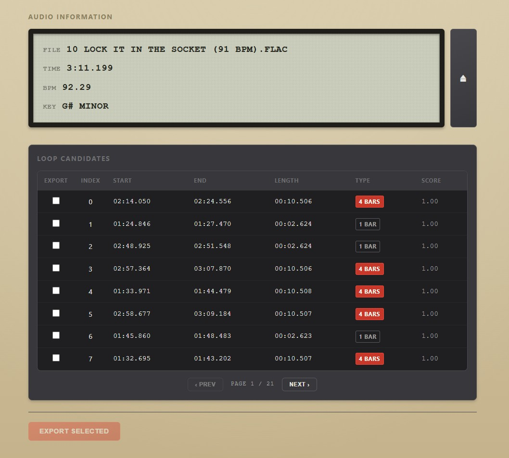

# Loopscooper

Automatic beat detection and loop discovery for producers.

Drag a song into Loopscooper and it finds the most likely beat drops — 2-bar and 4-bar loops, with 1-bar loops surfaced only when they score exceptionally well — then lets you preview and export them as clean, seamless WAV samples. Just drop a track, listen to what's there, and grab the loops you want.



## Features

- **Drag & drop audio** — web interface at `http://localhost:8282` or CLI
- **Auto-detect BPM** — estimates tempo and suggests 1-bar / 2-bar / 4-bar loop lengths in seconds
- **Auto-detect musical key** — uses the Krumhansl-Schmuckler algorithm to determine the track's key
- **Beat-locked detection** — anchors candidates to actually-detected beats an exact beat-count apart (not just a duration window), so loops start and end on the beat instead of merely being close to the right length
- **2-bar / 4-bar first** — 1-bar loops are short enough to sound incomplete, so they're only surfaced when the chroma/loudness match scores 90% or higher
- **Instant preview** — click any loop to hear it loop back-to-back in the browser, click again to stop
- **Paginated results** — candidates are sorted best-first and shown 8 per page, so a track with hundreds of candidates doesn't turn into an endless scroll
- **Export as ZIP** — select loops across any page and download them as a ready-to-use sample pack
- **Load a new file without reloading** — the eject button next to the display resets the session in place

## Installation

### From source

```sh
git clone https://github.com/<user>/loopscooper.git
cd loopscooper
uv pip install -e .
```

## Pre-requisites

- Python >=3.10
- [ffmpeg](https://ffmpeg.org/download.html) — required for additional audio formats

## Usage

### CLI

```sh
# Basic — finds file in CWD, auto-detects BPM, interactive preview & export
loopscooper song.wav

# Absolute path
loopscooper /Users/youruser/Music/song.wav

# Relative path
loopscooper ./music/song.wav
```

If the file is not found in the current working directory, the script will attempt to resolve it as a relative or absolute path. If still not found, it errors with a message asking the user to provide a valid file path.

### Web Interface

```sh
# From the project root
python web/server.py

# Or with the venv
.venv/bin/python web/server.py
```

The server listens on port 8282 by default (configurable via `PORT` environment variable). Access the interface at `http://localhost:8282`.

### Systemd Service

A systemd unit file is provided at `weblooperscoop.service`:

```sh
sudo cp weblooperscoop.service /etc/systemd/system/
sudo systemctl daemon-reload
sudo systemctl enable --now weblooperscoop
```

Access the interface at `http://localhost:8282`.

### Example CLI Session

```
$ loopscooper song.wav

Detected BPM: 100.00
Beat Duration: 0.600s

Suggested Loop Lengths (4/4 time):
  1 bar (4 beats):  2.400s
  2 bars (8 beats): 4.800s

Enter loop duration window (min,max in seconds) [2.4,4.8]: 2,8

Analyzing audio for loops (2-8s)...

Discovered loop points (25/47 displayed)

  Index │ Loop Start │ Loop End  │ Length
────────┼────────────┼───────────┼────────
      0 │ 0:12.345   │ 0:16.789  │ 0:04.444
      1 │ 0:24.567   │ 0:29.012  │ 0:04.445
      ...

Preview loop index (e.g., 0p, or "done" to skip): 0p
Previewing loop #0... (Ctrl+C to stop)

Preview loop index (e.g., 3p, or "done" to skip): done

Re-detect loops? (enter min,max duration or n) [n]: n

Enter loop indices to export (e.g., 0,1-3,5-8,10): 0,1-3,5-8,10

Exporting 9 loop(s) to song-samples/...
Exported song-01.wav (0:04.444)
...

Successfully exported 9 loop(s) to song-samples/
```

### Web Interface

1. **Drag & drop** or click to select an audio file
2. Analysis runs automatically — the display shows filename, duration, BPM, and key
3. Loop candidates are shown in a table with Type badges (1 Bar / 2 Bars / 4 Bars), sorted best-first, 8 per page — use **Prev / Next** to page through the rest
4. **Click any row** to preview that loop (plays loop section only, no intro)
5. **Click the same row again** to stop previewing
6. **Check boxes** next to loops you want to export — selections are kept when you change pages
7. Click **Export Selected** to download a ZIP of the chosen loops
8. Click the **⏏ eject button** next to the display to load a different file without reloading the page

### Output

Loops are exported to `{basename}-samples/` next to the source file:

```
~/
├── song.wav
└── song-samples/
    ├── song-01.wav
    ├── song-02.wav
    └── song-03.wav
```

Each file contains only the loop section (loop_start to loop_end), without intro or outro.

## API Endpoints (Web)

| Method | Endpoint | Description |
|--------|----------|-------------|
| `GET` | `/` | Main web interface |
| `POST` | `/upload` | Upload audio file, run analysis, return BPM/key/loops |
| `POST` | `/export` | Export selected loops as a zip download |
| `GET` | `/download/<id>/<path>` | Download exported zip file |
| `GET` | `/health` | Health check endpoint |

## Acknowledgement

This project is a heavily modified fork of [arkrow's PyMusicLooper](https://github.com/arkrow/PyMusicLooper), which itself started as a fork of [Nolan Nicholson's Looper](https://github.com/NolanNicholson/Looper/). The core audio analysis approach (librosa beat tracking, chroma cross-correlation) was inherited from those projects.

The web interface adds key detection using the Krumhansl-Schmuckler algorithm (1985), a widely-used method for tonal profile analysis implemented with zero new dependencies.

## License

MIT
